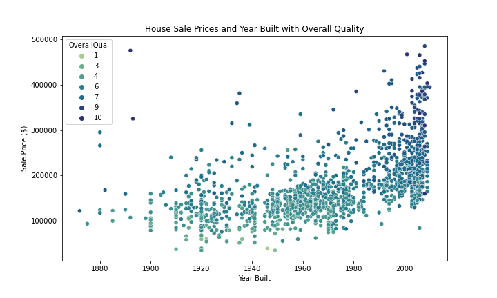
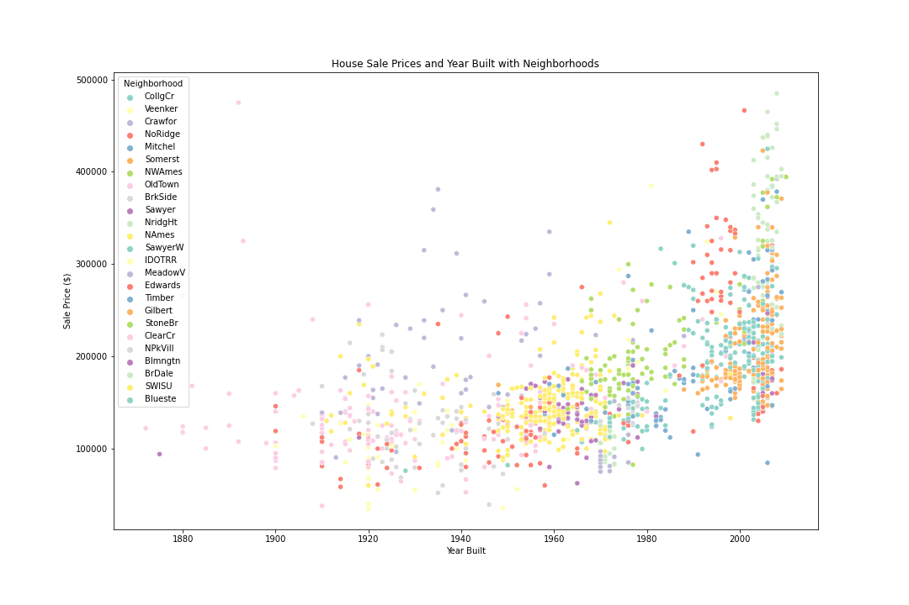
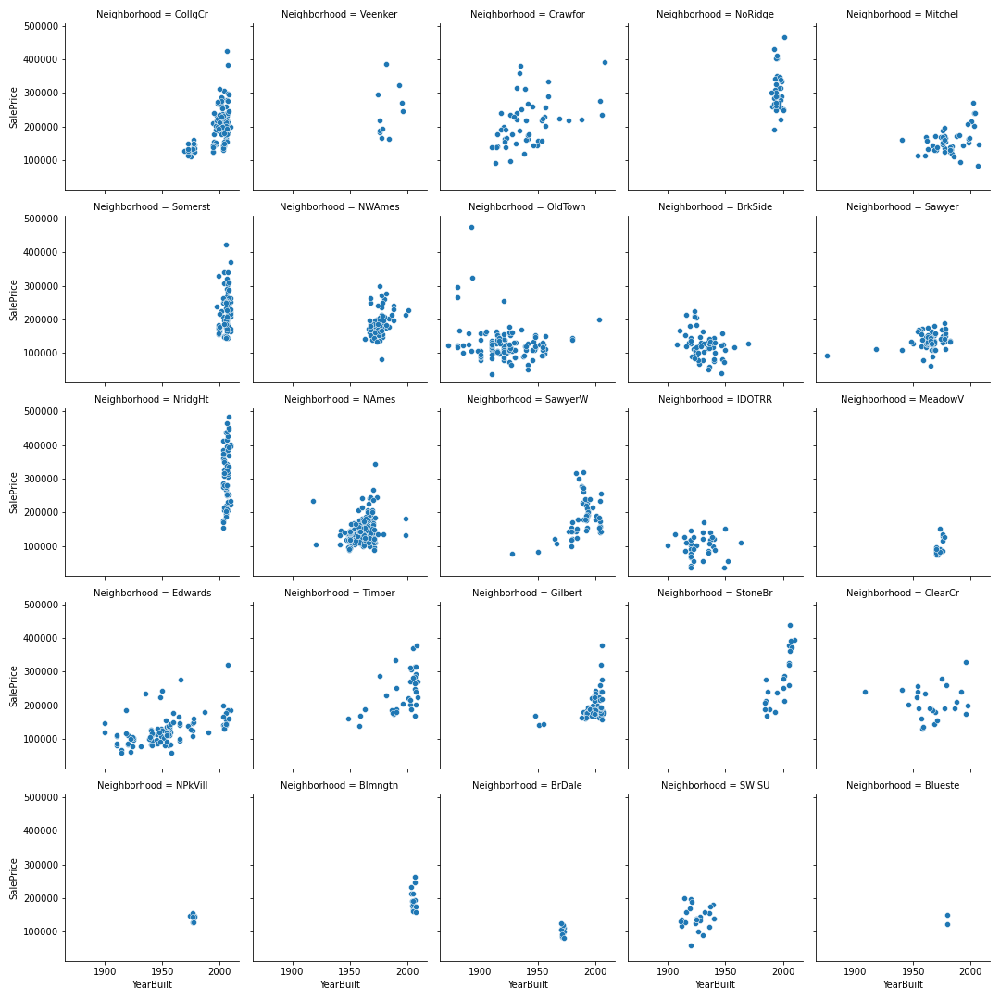

# Boston-Housing

## Introduction

  This dataset comes from a Kaggle competition that expands upon the famous Boston housing market dataset, which has 80 columns of predictors to analyze. I found the detail to the data very interesting and thought it could possibly make for more accurate predictions and provide good practice in dealing with data with large amounts of predictors but still perform data analysis. The goal of the assignment is to create a model that can accurately predict the sale price of houses.

## Exploratory Data Analysis (EDA)

  The dataset included numerous variables with regards to each individual house listing which included continous variables such as lot area and garage area, and categorical variables such as overall quality of the house (0-10) and whether or not the house an inlcuded central air or a paved driveway. This required extensive analysis in order to help better undertstand the relationship some of the variables have with predicting the house sale price. In order to eliminate colinearity present in the data a few variables were removed since they were essentially explaining the same thing as another variable.
  Some outliers were identified in the dataset when exploring the lot area as they seemed to not fit the trend exhibited by all the other houses in the dataset, so for the sake of accuracy these outliers were removed from the training dataset. A few other columns also exhibited lots of missing data, such as pool area, as most houses in the dataset did not have a pool this variable did not seem to provide much context so it was excluded from the models.
  

  This graph proved to be one of the most interesting, it shows a clear relationship with the year the house was built and its sale price. Newer built houses tend to sell more than older houses. There are a few outliers that are clearly present (houses built before 1900 selling for over $250,000) so it is insufficient to say that older houses always sell for less money than newer houses. However, once overall quality of the house is included in the graph these outliers seem to make more sense as the quality of these houses are extremely high despite their age so it would make sense that they would sell for just as much, if not more, than newer built houses of similar quality.

  At first glance this image can be a little difficult to interpret given the large amount of neighborhoods present in the dataset. It is clear however that most houses within a given neighborhood tend to be built around the same time so they share some similarity in sale price. Let's take a closer look with the image below.
  

As expected the groupings within most neighborhood subplots are very tightly grouped and can roughly indicate which year the houses were built and neighborhoods with more recently built houses tend to have higher sale prices. This is not always the case however like in neighborhoods like "NoRidge" and "Somerst" where the sale prices of the houses are very spread out but all of the houses were built at around the same exact time.

These are just a few examples of some of the important variables being considered in the dataset, each predictor explains some part of the houses sale price (sort of like puzzle pieces) when we combine all of these peices into a model only then can we solve the problem (or puzzle).
