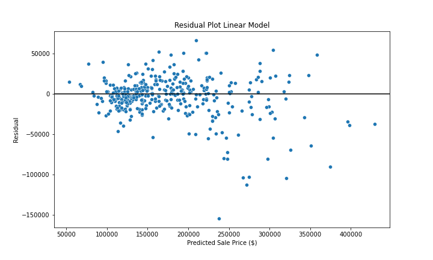
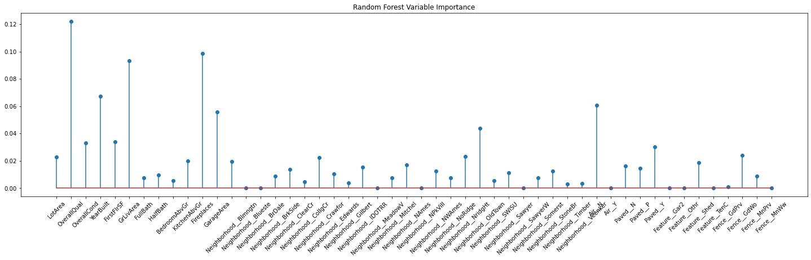
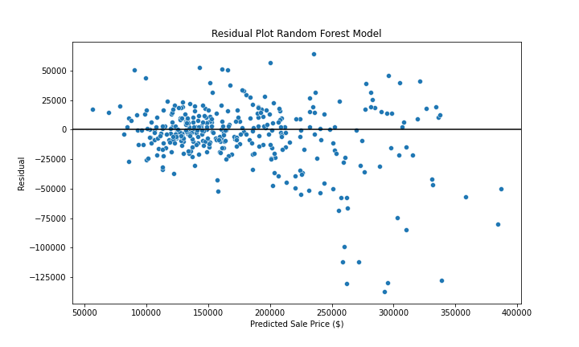
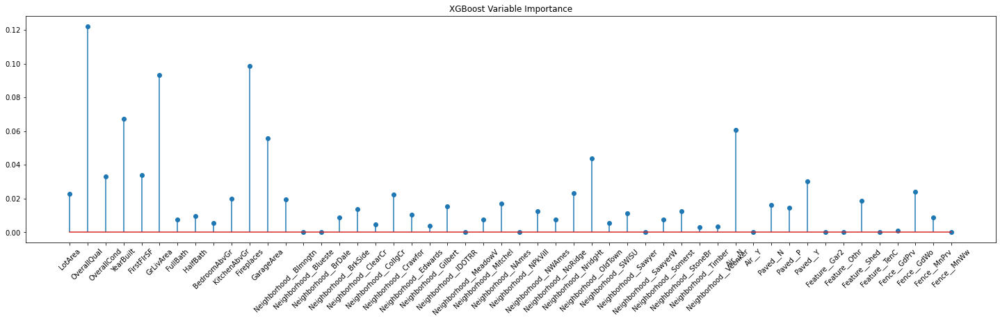
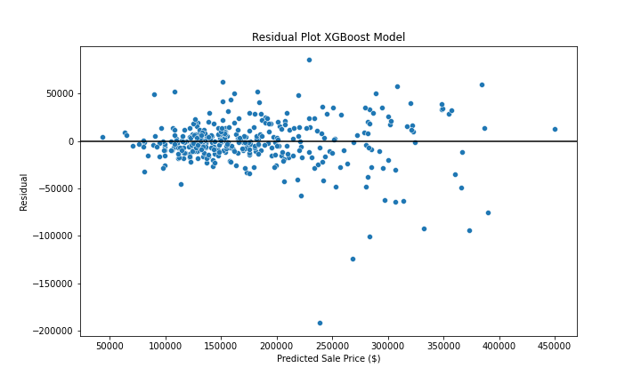
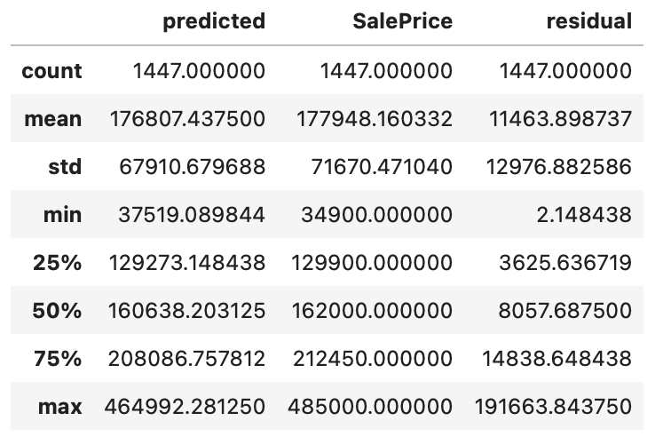
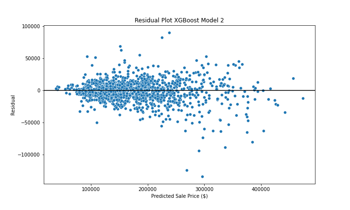

# Boston-Housing

## Introduction

  This dataset comes from a Kaggle competition that expands upon the famous Boston housing market dataset, which has 80 columns of predictors to analyze. I found the detail to the data very interesting and thought it could possibly make for more accurate predictions and provide good practice in dealing with data with large amounts of predictors but still perform data analysis. The goal of the assignment is to create a model that can accurately predict the sale price of houses.

## Exploratory Data Analysis (EDA)

  The dataset included numerous variables with regards to each individual house listing which included continous variables such as lot area and garage area, and categorical variables such as overall quality of the house (0-10) and whether or not the house an inlcuded central air or a paved driveway. This required extensive analysis in order to help better undertstand the relationship some of the variables have with predicting the house sale price. In order to eliminate colinearity present in the data a few variables were removed since they were essentially explaining the same thing as another variable.
  Some outliers were identified in the dataset when exploring the lot area as they seemed to not fit the trend exhibited by all the other houses in the dataset, so for the sake of accuracy these outliers were removed from the training dataset. A few other columns also exhibited lots of missing data, such as pool area, as most houses in the dataset did not have a pool this variable did not seem to provide much context so it was excluded from the models.
  

  This graph proved to be one of the most interesting, it shows a clear relationship with the year the house was built and its sale price. Newer built houses tend to sell more than older houses. There are a few outliers that are clearly present (houses built before 1900 selling for over $250,000) so it is insufficient to say that older houses always sell for less money than newer houses. However, once overall quality of the house is included in the graph these outliers seem to make more sense as the quality of these houses are extremely high despite their age so it would make sense that they would sell for just as much, if not more, than newer built houses of similar quality.

  At first glance this image can be a little difficult to interpret given the large amount of neighborhoods present in the dataset. It is clear however that most houses within a given neighborhood tend to be built around the same time so they share some similarity in sale price. Let's take a closer look with the image below.
  

As expected the groupings within most neighborhood subplots are very tightly grouped and can roughly indicate which year the houses were built and neighborhoods with more recently built houses tend to have higher sale prices. This is not always the case however like in neighborhoods like "NoRidge" and "Somerst" where the sale prices of the houses are very spread out but all of the houses were built at around the same exact time.

These are just a few examples of some of the important variables being considered in the dataset, each predictor explains some part of the houses sale price (sort of like puzzle pieces) when we combine all of these peices into a model only then can we solve the problem (or puzzle).

## Models

  Dummy variables were created for the following five categorical variables as they appeared to be the most important in trying to predict house sale price: Neighborhood, Central Air, Paved Driveway, Miscelaneous Feature, Fence. A baseline linear model was constructed using the predictors that were deemed important in the EDA analysis. The residual plot for the linear model on a testing set is below:
  

  There is a roughly cone-shaped pattern in the residual plot for the linear model so there may be some cause for concern as homoscedasticty may be violated. However, there appears to only be a negative increase in the residuals as predicted sale price increases, indicating that the model is under-estimating the sale prices of houses with large sale prices.

  The next model being considered is a random forest, a tuning grid for the maximum number of features was created with values of 5, 10, 15, 20, 25. Cross-validation identified the model with a maximum of 15 parameters as the best model. Each variable is assigned an importance value based on its performance in the cross-validation, the graph below shows the importance for each variable:
  

  Overall quality, first floor $ft^2$, and overall conditions were the three most important predictors identified by random forest. What's interesting is that none of the neighborhoods were identified as particularly important. Year built and ground living area were moderately important however those two variables appeared to show the clearest relationship with house sale price in the EDA.

  The random forest residual plot appears to show the same problem that was observed in the linear model residual plot, with larger predicted values having increasingly negative residuals. The overall maagnitude of the residuals has decreased with the random forest model compared to the linear model but there are still a handful of observations with very large residuals.
  
  The next model being considered is an XG Boost Tree, and a tuning grid was created for the three parameters just like what was done for the random forest. Cros-validation identified a learning rate of 0.05, a max depth of 3, and the number of estimators as 500. A variable importance graph was created for the XGB model and shown below:
  

  Unlike the variable importance graph produced for the random forest, multiple predictors had moderate importance with overall quality, first floor $ft^2$, and number of above ground kitchens as the most important. Noteably there is also a few neighborhood predictors that were given some importance along with a few other categorical predictors.
  

  The residual plot for the XGB model is shown above and as you can see there is a lot less variance in the spread of the residuals than what was present in the previous two residual plots. There is however, one extremely large residual that isn't at a very high sale price, but the model extremely underestimated the sale price of the house.
  
## Further Analysis

  The XGB model performed the best so one final prediction was done to measure the overall performance of the model on all of the data that was given. The breakdown of the predicted sale prices, the original sale prices, and the residuals is provided below:

  The average predicted sale price was not far from the actual average sale price, same goes for the standard deviation. Looking at the residual column we can determine the mean absolute error (MAE) of the model was approximately 11,463, meaning that on average the predicted sale price was off by $11,463 in either the positive or negative direction. One cool thing to point out is that the minimum residual was only 2.14 meaning that one predicted was only $2.14 off from the actual sale price. However, one serious issue is the maximum residual value of approximately 191,663 which shows just how wrong the model can be in trying to predict the sale price of houses in the dataset. This is one aspect that I hope to imporve upon futher in the future, maybe a confounding varaible was overlooked that can help explain some of the outliers.
  
## Conclusion

  A final XGB model was created using the same procedures as before, however this time a few additional variables were added to help improve the errors in the predictions of houses with high sale prices. The resulting residual plot is displayed on the right next to the original XGB model residual plot located on the left:
  
{width = 50%} {width = 50%}
